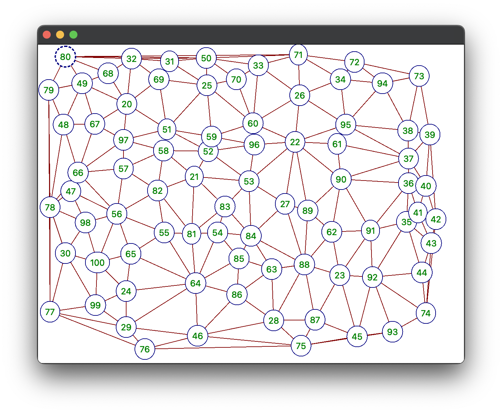

# Divide and Conquer Delaunay triangulation

A C++/QT divide and conquer implementation of Delaunay triangulation.

_Note that qt 6 is required for the app._

_Tested on MacBook M1._

## Installation

1. Prepare Makefile
```shell
qmake -makefile
```

2. Build the project
```shell
make
```

3. Run the `triangulation` executable

## Screenshots


